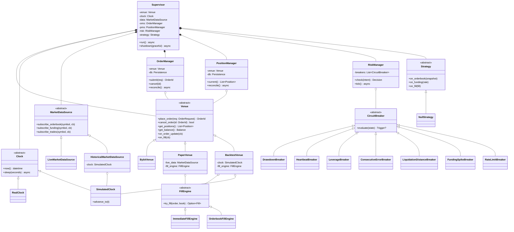
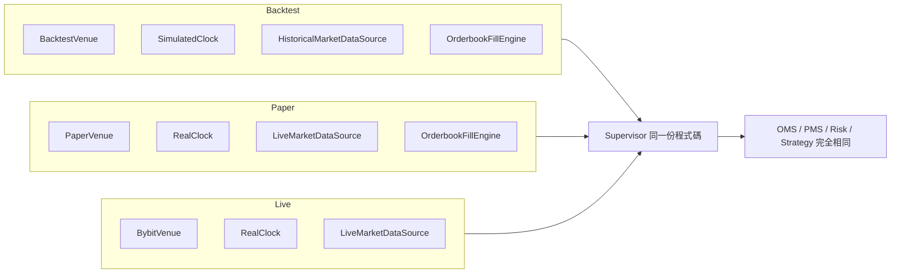
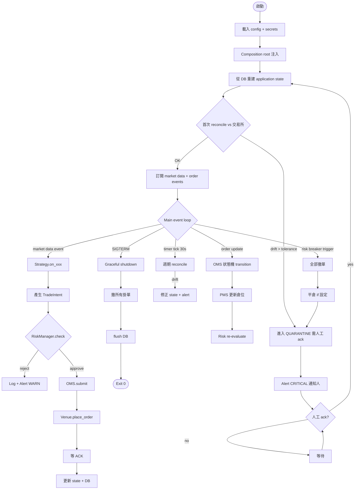
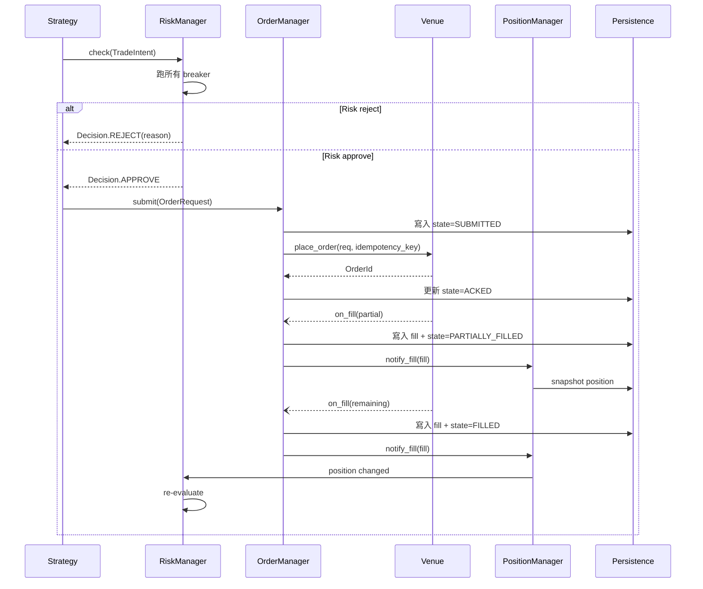
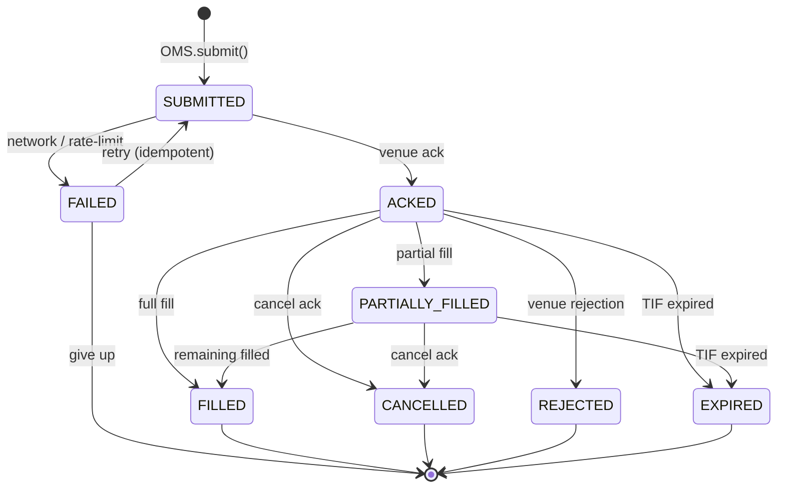
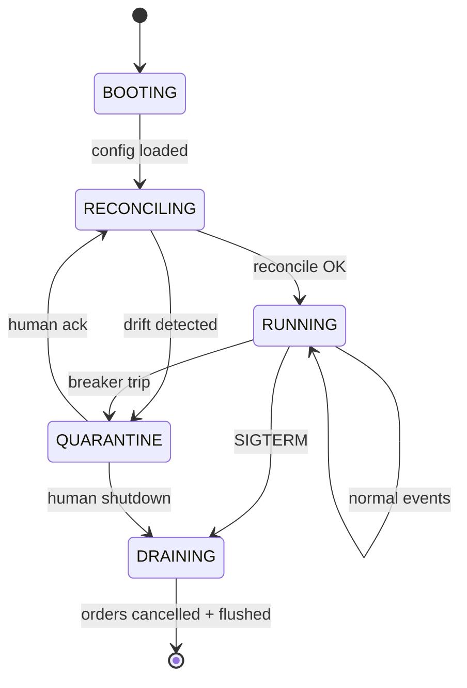

# Phase 0 Design — Trading Infrastructure Foundation

**狀態**：Phase 0 內部完整 + durability + entrypoint 就緒（18 ABCs + 33 concrete impls + 286 tests + 0 mypy issues + `python -m trading --db-path` 可長跑）。Phase 0 Gate 尚未通過 — 缺真實 Venue (BybitVenue) / LiveMarketDataSource / Telegram alert / drift detection chaos test / 7-day paper run
**最後更新**：2026-05-20
**範圍**：本文件僅涵蓋 Phase 0（infra foundation）— 無 alpha、無資金、純基建
**配對閱讀**：[SYSTEM_OVERVIEW.md](SYSTEM_OVERVIEW.md)（白話 + 流程圖版本）；`tests/` 目錄是 executable spec

---

## 1. Context

### 1.1 為什麼有這份 doc

過去兩條路徑已驗證不可行：

1. **LLM 直接設計交易策略** — 隔壁 repo（`Trade` / `claudeAutoTrade` 等）累積的 pipeline 雖然完整，但生成的策略「回測過、live/paper 不過」，屬於 out-of-sample decay 的統計現象，不是 pipeline bug
2. **LLM 直接下單** — 延遲、成本、不可審計、不可重現

結論：**LLM 不應該在 alpha generation 或 execution 的關鍵路徑**。本系統採取分層設計，LLM 只在監控與升級 staging 層出現。

### 1.2 整體分層

| 層 | 內容 | LLM 角色 |
|---|---|---|
| Alpha | 少參數、有經濟邏輯支撐的策略集合：funding rate arb、basis trade、market making、cross-exchange spread | ❌ 不參與 |
| Execution | 純程式碼，OMS / PMS / market data，sub-second 反應 | ❌ 不參與 |
| Risk | 硬編碼 circuit breaker | ❌ 不參與 |
| Monitor & Upgrade Staging | PnL 歸因、regime 偵測、異常解釋、參數調整建議（必須過 paper gate） | ✅ 主場 |

### 1.3 Phase 0 範圍（本 doc）

只解決一件事：**能不能可靠地把訊號變成倉位變化**。不解決賺錢問題，不放任何 alpha 邏輯，不接 LLM。

通過 Phase 0 才進 Phase 1（funding capture POC）；通過 Phase 1 才進 Phase 2（接 LLM 監控層）。

### 1.4 非目標

- 不追求高頻、不追求 sub-millisecond 延遲
- 不支援多交易所（Phase 0 只接 Bybit）
- 不做 ML / RL
- 不做 microstructure 預測
- 不自動升級策略到 live（永遠經人工 ack）

### 1.5 Implementation Snapshot

當前已落地的具體成果（與本 doc 後續描述的設計意圖對齊）。

#### 抽象介面（18 ABCs + 1 Protocol）

| 層 | 介面 | 用途 |
|---|---|---|
| Time | `Clock` | 時間源（real / simulated）|
| Exchange | `Venue` | 交易所操作 + 私有事件 |
| Public data | `MarketDataSource` | 行情訂閱 |
| Fill sim | `FillEngine` | paper / backtest 模擬成交 |
| Strategy | `Strategy` | 事件處理（策略邏輯）|
| Strategy facade | `Executor` | 策略對外唯一接口 |
| Orders | `OrderManager` | 訂單狀態機 |
| Account | `PositionManager` | 倉位 / 餘額 cache |
| Risk - mgr | `RiskManager` | 風控閘門 + 週期 tick |
| Risk - breaker | `CircuitBreaker` | 單一風控檢查 |
| Pub/sub | `EventBus` | 跨元件事件分派 |
| Top-level | `Supervisor` | 整體 lifecycle orchestrator |
| Lifecycle | `Lifecycle` (Protocol) | start/stop 結構型介面 |
| Alerts - router | `AlertRouter` | Alert 分派 |
| Alerts - channel | `AlertChannel` | Alert 出口 |
| Persist - orders | `OrderJournal` | 訂單 + fill append-only |
| Persist - account | `AccountJournal` | 倉位 + 餘額 snapshot |
| Persist - events | `EventLog` | 通用 runtime event 持久化 |
| Persist - alerts | `AlertLog` | 已發送 alert 記錄 |

#### 具體實作（21 concrete）

| 抽象 | 實作 | 適用 mode | 狀態 |
|---|---|---|---|
| Clock | `RealClock` | live / paper | ✅ |
| Clock | `SimulatedClock` | backtest | ❌ 未建 |
| Venue | `NullVenue` | infra test only | ✅（`place_order` 拋例外）|
| Venue | `BybitVenue` | live | ❌ 未建 |
| Venue | `PaperVenue` | paper | ❌ 未建 |
| Venue | `BacktestVenue` | backtest | ❌ 未建 |
| MarketDataSource | `NullMarketDataSource` | infra test | ✅ |
| MarketDataSource | `LiveMarketDataSource` | live / paper | ❌ 未建 |
| MarketDataSource | `HistoricalMarketDataSource` | backtest | ❌ 未建 |
| FillEngine | `ImmediateFillEngine` | paper / backtest | ❌ 未建 |
| FillEngine | `OrderbookFillEngine` | paper / backtest | ❌ 未建 |
| Strategy | `NullStrategy` | infra test | ✅ |
| Executor | `DefaultExecutor` | all | ✅（組合 Risk + OMS + PMS）|
| OrderManager | `NullOrderManager` | infra test | ✅ |
| OrderManager | `DefaultOrderManager` | all | ✅（訂閱 venue events + 寫 journal）|
| PositionManager | `NullPositionManager` | infra test | ✅ |
| PositionManager | `DefaultPositionManager` | all | ✅（reconcile 拉 venue 全狀態）|
| RiskManager | `NullRiskManager` | infra test | ✅（**危險**：永遠 Approve）|
| RiskManager | `DefaultRiskManager` | all | ✅（breakers + RiskContext）|
| CircuitBreaker | `HeartbeatBreaker` | all | ✅ non-latching, QUARANTINE |
| CircuitBreaker | `ConsecutiveErrorBreaker` | all | ✅ non-latching, QUARANTINE |
| CircuitBreaker | `DrawdownBreaker` | all | ✅ **latching** (via `SystemStateChanged`), FLATTEN |
| CircuitBreaker | `LeverageBreaker` | all | ✅ stateless, REJECT_NEW |
| CircuitBreaker | `PositionNotionalBreaker` | all | ✅ stateless, REJECT_NEW |
| CircuitBreaker | `LiquidationDistanceBreaker` | all | ✅ stateless, FLATTEN |
| CircuitBreaker | `FundingSpikeBreaker` | all | ✅ stateless (no-op until funding cache wired) |
| CircuitBreaker | `RateLimitBreaker` | all | ✅ **auto-clearing cooldown**, REJECT_NEW |
| EventBus | `InMemoryEventBus` | all | ✅（sync 同程序）|
| Supervisor | `DefaultSupervisor` | all | ✅（lifecycle + tick loop）|
| AlertRouter | `InMemoryAlertRouter` | all | ✅ |
| AlertChannel | `LogChannel` | all | ✅（Python logging）|
| AlertChannel | Telegram / Email / Ntfy | live / paper | ❌ 未建 |
| OrderJournal | `InMemoryOrderJournal` | test / POC | ✅ |
| OrderJournal | `SQLiteOrderJournal` | all | ✅ (WAL, Decimal-as-TEXT, durability tested) |
| AccountJournal | `InMemoryAccountJournal` | test / POC | ✅ |
| AccountJournal | `SQLiteAccountJournal` | all | ✅ |
| EventLog | `InMemoryEventLog` | test / POC | ✅ |
| EventLog | `SQLiteEventLog` | all | ✅ (generic dataclass JSON serde via `_serde.py`) |
| AlertLog | `InMemoryAlertLog` | test / POC | ✅ |
| AlertLog | `SQLiteAlertLog` | all | ✅ |
| FillEngine | `ImmediateFillEngine` | paper / backtest | ✅ (top-of-book taker; POST_ONLY pre-check 在 PaperVenue) |
| Venue | `PaperVenue` | paper | ✅ (live data + 模擬成交 + position math + PnL accounting) |
| Entrypoint | `runtime/main.py` + `__main__.py` | all | ✅ (`python -m trading --db-path ...` with SIGTERM handler) |

#### 測試覆蓋（286 tests）

- `test_abc_contracts.py` — 18 個 ABC 都驗證拒絕直接實例化、ADT 結構、frozen / slots
- 每個 concrete impl 都有對應 unit test file
- `test_default_supervisor.py` — Supervisor lifecycle（boot/idle/shutdown/quarantine/ack）
- `test_supervisor_heartbeat_integration.py` — 第一個 event-driven 端到端 chain（heartbeat → breaker → BreakerTripped → QUARANTINE）
- `test_default_stack_integration.py` — 全 Default stack（OMS+PMS+Risk+DrawdownBreaker+Supervisor）端到端
- `test_paper_stack_integration.py` — PaperVenue + Default stack 完整 paper trading 路徑（含 drawdown 由真實 PnL 觸發）
- `test_main_entrypoint.py` — `build_supervisor` 組裝 + entrypoint durability（restart 後 transitions 在 journal）
- 全套 durability tests — SQLite journals 重啟後資料還在
- Restore tests — OMS/PMS `start()` 從 journal 還原 cache

#### 工具鏈

- `pyproject.toml`（hatchling build, src-layout, dep: `aiosqlite`）
- ruff lint + format
- mypy strict（120 source files, 0 issues）
- pytest + pytest-asyncio（asyncio_mode = "auto"）— **~5s runtime**

---

## 2. 執行模式

系統有三種 mode，**共用同一份程式碼**，差別只在 composition root 注入哪些具體類別。

| Mode | 用途 | Market data | Clock | Order fill | 速度 |
|---|---|---|---|---|---|
| **Backtest** | 歷史回放、策略邏輯驗證、reproducibility | 歷史 DB | Simulated（事件驅動） | Mock fill engine | 1 hr → 數秒 |
| **Paper** | infra 壓測、live data 行為驗證、pre-live gate | 真實 WebSocket | Real | Mock fill engine | 1:1 real time |
| **Live** | 真錢 | 真實 WebSocket | Real | 真交易所 | 1:1 real time |

**進場流程強制**：`Backtest 驗證 → Paper ≥ 7 天 → 小資金 Live ≥ 14 天 → 加倉`。任何一道不過就回頭，不可繞過。

---

## 3. OO 設計原則

| 原則 | 在本系統的應用 |
|---|---|
| Dependency Inversion | `Supervisor` 依賴抽象介面（`Venue` / `Clock` / `MarketDataSource` / `FillEngine`），不依賴具體類別 |
| Single Responsibility | OMS 只管訂單狀態、PMS 只管倉位、Risk 只管 breaker、Strategy 只發 intent |
| Open / Closed | 加新交易所、新策略、新 breaker、新 fill engine 都不改 core，只新增類別 + 改 composition root |
| Composition over Inheritance | `Strategy` 不繼承 base 拿到 OMS — 建構式被注入依賴 |
| Tell, Don't Ask | 事件驅動：`Strategy` 收到 `on_orderbook(state)`，不主動 poll |
| Lint-enforced Clock | 任何用到時間的地方必須走 `Clock` 介面，禁直接 `datetime.now()` / `time.time()`（否則 backtest 會有 leak） |

---

## 4. Module 結構

### 4.1 實際結構（當前）

每個子套件遵循「`base.py` = ABC、`<name>.py` = concrete」的 layout。

```
src/trading/
├── domain/                          # 共用 value objects (frozen + slots + Decimal)
│   ├── alert.py                     # Alert + AlertLevel
│   ├── balance.py                   # Balance
│   ├── decision.py                  # Decision ADT (Approved | Rejected)
│   ├── fill.py                      # Fill
│   ├── funding.py                   # FundingRate
│   ├── ids.py                       # Symbol / OrderId / ClientOrderId (NewType)
│   ├── market_data.py               # Level / OrderbookSnapshot / Trade
│   ├── order.py                     # OrderRequest / Order + enums + TradeIntent
│   ├── position.py                  # Position + PositionSide
│   ├── risk_context.py              # RiskContext (傳給 breaker 的 snapshot)
│   ├── submit_result.py             # SubmitResult ADT (4 variants)
│   └── trigger.py                   # TriggerAction + Trigger
├── clock/
│   ├── base.py                      # Clock ABC
│   └── real.py                      # RealClock ✅
├── venues/
│   ├── base.py                      # Venue ABC
│   ├── null.py                      # NullVenue ✅ (place_order 拋例外)
│   └── paper.py                     # PaperVenue ✅ (live data + simulated fills + position math)
├── market_data/
│   ├── base.py                      # MarketDataSource ABC
│   └── null.py                      # NullMarketDataSource ✅
├── fill/
│   ├── base.py                      # FillEngine ABC
│   └── immediate.py                 # ImmediateFillEngine ✅
├── strategy/
│   ├── base.py                      # Strategy ABC
│   └── null.py                      # NullStrategy ✅
├── executor/
│   ├── base.py                      # Executor ABC
│   └── default.py                   # DefaultExecutor ✅
├── oms/
│   ├── base.py                      # OrderManager ABC
│   ├── null.py                      # NullOrderManager ✅
│   └── default.py                   # DefaultOrderManager ✅
├── pms/
│   ├── base.py                      # PositionManager ABC
│   ├── null.py                      # NullPositionManager ✅
│   └── default.py                   # DefaultPositionManager ✅
├── risk/
│   ├── base.py                      # RiskManager ABC
│   ├── null.py                      # NullRiskManager ✅
│   ├── default.py                   # DefaultRiskManager ✅
│   └── breakers/
│       ├── base.py                  # CircuitBreaker ABC
│       ├── heartbeat.py             # HeartbeatBreaker ✅
│       ├── consecutive_error.py     # ConsecutiveErrorBreaker ✅
│       ├── drawdown.py              # DrawdownBreaker ✅ (latching)
│       ├── leverage.py              # LeverageBreaker ✅
│       ├── position_notional.py     # PositionNotionalBreaker ✅
│       ├── liquidation_distance.py  # LiquidationDistanceBreaker ✅
│       ├── funding_spike.py         # FundingSpikeBreaker ✅
│       └── rate_limit.py            # RateLimitBreaker ✅
├── alerts/
│   ├── channels/
│   │   ├── base.py                  # AlertChannel ABC
│   │   └── log.py                   # LogChannel ✅
│   └── router/
│       ├── base.py                  # AlertRouter ABC
│       └── in_memory.py             # InMemoryAlertRouter ✅
├── persistence/
│   ├── _serde.py                              # generic dataclass JSON encoder/decoder for EventLog
│   ├── order_journal/{base, in_memory, sqlite}.py   # OrderJournal + ✅ + ✅ SQLite
│   ├── account_journal/{base, in_memory, sqlite}.py # AccountJournal + ✅ + ✅ SQLite
│   ├── event_log/{base, in_memory, sqlite}.py       # EventLog + ✅ + ✅ SQLite
│   └── alert_log/{base, in_memory, sqlite}.py       # AlertLog + ✅ + ✅ SQLite
├── runtime/
│   ├── events.py                    # SystemStateChanged, BreakerTripped, Heartbeat, ...
│   ├── lifecycle.py                 # Lifecycle Protocol (runtime_checkable)
│   ├── system_state.py              # SystemState enum (6 states)
│   ├── main.py                      # ✅ Composition root + CLI argparse + SIGTERM handler
│   ├── event_bus/
│   │   ├── base.py                  # EventBus ABC
│   │   └── in_memory.py             # InMemoryEventBus ✅
│   └── supervisor/
│       ├── base.py                  # Supervisor ABC
│       └── default.py               # DefaultSupervisor ✅ (lifecycle + tick loop + Lifecycle gate)
└── __main__.py                      # ✅ `python -m trading` entry — delegates to runtime/main.py

tests/
├── test_abc_contracts.py                       # 18 ABCs 拒絕實例化 + ADT 結構
├── test_real_clock.py
├── test_in_memory_event_bus.py
├── test_in_memory_persistence.py
├── test_default_supervisor.py
├── test_heartbeat_breaker.py
├── test_consecutive_error_breaker.py
├── test_drawdown_breaker.py
├── test_default_risk_manager.py
├── test_default_order_manager.py
├── test_default_position_manager.py
├── test_supervisor_heartbeat_integration.py    # event chain → QUARANTINE
└── test_default_stack_integration.py           # 全 Default stack 端到端
```

### 4.2 規劃但未建（Phase 0 後續或 Phase 1）

```
venues/
├── bybit/                # ❌ Bybit REST + WS adapter（Phase 1 入口）
└── backtest/             # ❌ BacktestVenue (uses SimulatedClock)

clock/simulated.py        # ❌ SimulatedClock (backtest 用)

market_data/
├── live.py               # ❌ LiveMarketDataSource (Bybit WS) — funding subscriber 也在這
└── historical.py         # ❌ HistoricalMarketDataSource (replay)

fill/
└── orderbook.py          # ❌ OrderbookFillEngine (walks book depth, 更精細的 paper fill)

alerts/channels/
├── telegram.py           # ❌ TelegramChannel
├── email.py              # ❌ EmailChannel
└── ntfy.py               # ❌ NtfyChannel

runtime/
├── health.py             # ❌ health endpoint (HTTP /health)
└── shutdown.py           # ❌ extracted SIGTERM handler if main.py grows
```

---

## 5. Class Diagram（核心抽象）



---

## 6. Composition Root（mode 拼裝）



決定模式只在 `runtime/main.py`：

```python
def build_supervisor(mode: Mode, cfg: Config) -> Supervisor:
    if mode == Mode.BACKTEST:
        clock = SimulatedClock(start=cfg.backtest_start)
        data = HistoricalMarketDataSource(clock, source=DuckDBReader(cfg.data_path))
        venue = BacktestVenue(clock, fill_engine=OrderbookFillEngine())
    elif mode == Mode.PAPER:
        clock = RealClock()
        data = LiveMarketDataSource(BybitWS(read_only=True))
        venue = PaperVenue(live_data=data, fill_engine=OrderbookFillEngine())
    elif mode == Mode.LIVE:
        clock = RealClock()
        data = LiveMarketDataSource(BybitWS())
        venue = BybitVenue(api_key=cfg.key, secret=cfg.secret)

    db = SqliteDB(cfg.db_path)
    return Supervisor(
        venue=venue, clock=clock, data=data,
        oms=OrderManager(venue, db),
        pms=PositionManager(venue, db),
        risk=RiskManager(breakers=build_breakers(cfg)),
        strategy=cfg.strategy_factory(),
        alerts=AlertRouter(cfg.channels),
    )
```

---

## 7. Runtime Supervisor Flow



---

## 8. Order Lifecycle Sequence



---

## 9. State Machines

### 9.1 Order 狀態機



### 9.2 System 狀態機



`QUARANTINE` 是核心安全網：breaker 觸發 → 不會自動回 RUNNING，必須人工 ack。「無人值守」= 99% 時間機器自己跑，異常時主動 page 人。

---

## 10. Risk / Circuit Breaker 規格

Phase 0 必須的 hardcoded breakers。所有閾值在 config，但 breaker 邏輯本身不可動態啟停。

| Breaker | 觸發條件（占位值） | Action | Latching | 狀態 |
|---|---|---|---|---|
| `DrawdownBreaker` | window 內 drawdown > 5% | FLATTEN | **yes** | ✅ |
| `ConsecutiveErrorBreaker` | window 內 N 個 error | QUARANTINE | no | ✅ |
| `HeartbeatBreaker` | 元件 N 秒無心跳 | QUARANTINE | no | ✅ |
| `LeverageBreaker` | 實際槓桿 > 3x | REJECT_NEW | no | ✅ |
| `RateLimitBreaker` | 被交易所 429 連續 N 次 | REJECT_NEW (5min) | **auto-clearing** | ✅ |
| `LiquidationDistanceBreaker` | 距離清算 < 20% | FLATTEN | no | ✅ |
| `FundingSpikeBreaker` | abs(funding) > 0.5% / 8h | REJECT_NEW | no | ✅ \* |
| `PositionNotionalBreaker` | 單一倉位 > USD cap | REJECT_NEW | no | ✅ |

\* FundingSpikeBreaker 等於 no-op until funding rate cache 接到 RiskManager — DefaultRiskManager 目前 `funding_rates` 永遠空 dict。Breaker code 完成且測試覆蓋（用測試專屬 RiskContext 餵 funding rate 驗邏輯），但 production 行為要等 Phase 1 funding cache 上線。

每個 breaker 都必須有對應的 chaos test。

### Action 嚴重度層級

不是線性 — `QUARANTINE` ≠ `FLATTEN`：

| Action | 拒新單 | 撤舊單 | 平倉 | 進 QUARANTINE |
|---|---|---|---|---|
| `REJECT_NEW` | ✅ | ❌ | ❌ | ❌ |
| `CANCEL_ALL` | ✅ | ✅ | ❌ | ❌ |
| `QUARANTINE` | ✅ | ✅ | ❌ | ✅ |
| `FLATTEN` | ✅ | ✅ | ✅ | ✅ |

`QUARANTINE` 用於「連線/狀態不可信」（heartbeat loss、連續錯誤）— 倉位可能還是好的，平倉只會加亂。
`FLATTEN` 用於「倉位本身不安全」（drawdown breach、清算距離過近）— 必須先平倉。

### Latching 政策

`CircuitBreaker` ABC 本身不規定 latching — 每個 breaker 自己決定：

- **Non-latching**：條件解除就 clear（heartbeat 回來、error 老化）
- **Latching**：trip 後直到「QUARANTINE → RECONCILING」transition（即人工 `acknowledge()`）才清

DrawdownBreaker 是 latching，靠訂閱 `SystemStateChanged` event 接收 acknowledge 訊號 — **不需要在 ABC 加 `reset()` 方法**（詳見 §18.1）。

---

## 11. 各 Module 完工標準

✅ = 已完成 ｜ ⏳ = ABC 已建但 concrete 部分缺 ｜ ❌ = 完全未建

### 11.1 Venue adapter ❌（除 NullVenue）
- ✅ Venue ABC + NullVenue
- ❌ BybitVenue REST + WS
- ❌ WebSocket 自動重連 + state resync
- ❌ 所有 outbound call 有 timeout + retry + idempotency key
- ❌ 5% packet loss + 200ms delay 注入測試通過
- ❌ testnet + mainnet read-only smoke test 通過

### 11.2 OMS ✅ (除 chaos test)
- ✅ OrderManager ABC + DefaultOrderManager + NullOrderManager
- ✅ Order 狀態機型別齊全（8 個 status）
- ✅ DefaultOMS 訂閱 venue events 寫 journal
- ✅ **`DefaultOMS.start()` 從 journal 還原 cache** (Lifecycle 結構性整合)
- ❌ FAILED → 重試（cid idempotency 未做）
- ❌ Race condition chaos test（同時撤單 + fill）

### 11.3 PMS ✅ (除 chaos test)
- ✅ PositionManager ABC + DefaultPositionManager + NullPositionManager
- ✅ Default 在 Supervisor tick loop 每 N 秒 reconcile
- ✅ **`DefaultPMS.start()` 從 journal 還原 balance + positions** (`read_all_latest_positions`)
- ❌ Drift detection（diff cache vs venue）+ alert
- ❌ 注入假倉位 chaos test
- ❌ 模擬 fill 通知遺失 → reconciliation catch up（DefaultPMS 不訂閱 fill，靠 reconcile 全替換）

### 11.4 Risk ✅ (除 chaos test)
- ✅ RiskManager ABC + DefaultRiskManager + NullRiskManager
- ✅ CircuitBreaker ABC + **全 8 個 concrete**
  - non-latching: Heartbeat / ConsecutiveError / Leverage / PositionNotional / LiquidationDistance / FundingSpike
  - latching (via SystemStateChanged): Drawdown
  - auto-clearing cooldown: RateLimit
- ✅ Trip → BreakerTripped → Supervisor.quarantine() chain（integration tested）
- ✅ Latching via SystemStateChanged（DrawdownBreaker）
- ❌ Chaos test：每個 breaker 在真實事件流下行為驗證
- ❌ Breaker 評估延遲量測 < 100ms p99
- ❌ Funding rate cache 接入 DefaultRiskManager（FundingSpikeBreaker 才能 production-active）

### 11.5 Market data ❌（除 ABC）
- ✅ MarketDataSource ABC + NullMarketDataSource
- ❌ LiveMarketDataSource (Bybit WS)
- ❌ HistoricalMarketDataSource (backtest replay)
- ❌ L2 sequence gap 自動 resnapshot
- ❌ Stale data 監測

### 11.6 Persistence ✅ (除 chaos test)
- ✅ 4 個窄 ABC（OrderJournal / AccountJournal / EventLog / AlertLog，遵守 ISP）
- ✅ 4 個 InMemory* concrete（測試 + POC 用）
- ✅ **4 個 SQLite* concrete**（WAL mode, Decimal-as-TEXT, durability tested）
- ✅ Append-only 語意（無 update / delete API）
- ✅ **Crash 後從 DB 重建 application state**（OMS/PMS Lifecycle start restore）
- ✅ Restart durability tests（每個 SQLite journal）
- ❌ Chaos test：drift detection + 對帳告警

### 11.7 Alerts ⏳
- ✅ AlertRouter ABC + InMemoryAlertRouter
- ✅ AlertChannel ABC + LogChannel
- ✅ 4 個 AlertLevel (INFO / WARN / ALERT / CRITICAL) + level routing
- ✅ 每個 channel send 異常被 router catch（不阻塞其他 channel）
- ❌ TelegramChannel / EmailChannel / NtfyChannel
- ❌ Dedup 機制（correlation_key 欄位有但 InMemory 沒實作）
- ❌ Rate limit / batching

### 11.8 Runtime ✅ (除 health endpoint / systemd)
- ✅ Supervisor ABC + DefaultSupervisor
- ✅ SystemState 6-state 狀態機 + transition events（含 STOPPED 寫入 journal）
- ✅ EventBus ABC + InMemoryEventBus
- ✅ Lifecycle Protocol (structural typing) — DefaultOMS/PMS 沿用做 restore
- ✅ Tick loop (Heartbeat publish + PMS reconcile + Risk tick)
- ✅ Graceful shutdown 順序（tick task cancel → drain → reverse stop → STOPPED transition → persistence stop）
- ✅ **`runtime/main.py` CLI 入口**（`python -m trading`, `--tick-interval`, `--db-path`, `--log-level`）
- ✅ **SIGTERM handler**（Linux 上 `loop.add_signal_handler`，Windows fallback 經 KeyboardInterrupt）
- ❌ Health endpoint (HTTP /health for k8s/docker)
- ❌ systemd / docker-compose unit 範本
- ❌ Crash loop detect → 自動 QUARANTINE

### 11.9 Backtest mode ❌
- ✅ Clock ABC 設計支援 backtest（async sleep + monotonic）
- ❌ SimulatedClock concrete
- ❌ HistoricalMarketDataSource (clock-driven replay)
- ❌ BacktestVenue concrete
- ❌ End-to-end backtest reproducibility 驗證

---

## 12. Phase 0 整體 Gate

通過所有以下條件才能進 Phase 1：

1. **Paper mode 連跑 7 個自然日**（含週末、含 funding settlement）
2. 0 個未對齊的 reconciliation drift
3. 至少演練過 3 個 breaker trigger，行為符合 spec
4. 模擬 socket 斷線 / API 限速 / 重啟，狀態完整恢復
5. Alert 全部按設計 fire 到對應 channel
6. Backtest mode 跑 1 年歷史 data，結果 reproducible
7. 所有 module 的單元測試 + chaos test 通過

**沒過不要前進**。Phase 1 開始放策略邏輯，infra 有缺陷會被放大。

---

## 13. Phase Roadmap（後續階段預告）

| Phase | 內容 | LLM | 資金 |
|---|---|---|---|
| 0（本 doc） | Infra foundation | ❌ | ❌ |
| 1 | Single edge POC（funding rate capture） | ❌ | 小資金 |
| 2 | LLM 監控層：PnL 歸因、regime 偵測、參數調整建議（過 paper gate） | ✅ | 同 Phase 1 |
| 3+ | 加 edge（cross-exchange spread、basis、stat arb）、加 venue、加 size | ✅ | 階梯加倉 |

---

## 14. Reuse 評估（隔壁 LLM repo）

| 物件 | 評估 | 行動 |
|---|---|---|
| `@pandas_safe` 系列裝飾器 | market data 處理會用到 | 直接搬 |
| `src/domain/` 概念抽取 pattern | 用同樣 discipline 定義交易 domain types | 套用 pattern，不搬 code |
| pytest 模式（test_domain_X.py） | 一致沿用 | 沿用 |
| BacktestEngine | 研究系統設計，不是交易系統設計 | ❌ 不搬，會帶 baggage |
| Designer / few-shot / regime gate | 研究 pipeline，跟 trading infra 無關 | ❌ 不搬 |

---

## 15. Tech 選擇

| 項目 | 選擇 | 理由 |
|---|---|---|
| 語言 | Python 3.11+ | 沿用既有環境；OMS / market data 若日後有延遲需求再考慮 Rust extension |
| 交易所（Phase 0） | Bybit | API 成熟、unified margin 簡化 OMS、台灣可用、liquidity 足 |
| DB | SQLite or DuckDB | 單機、零運維、append-only 即可 |
| Process supervisor | systemd or docker-compose | 不要自己重造 |
| Alert channel | Telegram bot（主）+ Email（備） | 設置簡單、即時 |
| Async runtime | asyncio | 標準函式庫 |
| 型別檢查 | mypy strict | OMS 狀態機需要強型別 |
| Lint | ruff + 自訂規則禁 `datetime.now()` / `time.time()` | 強制走 Clock |

---

## 16. Open Decisions / TODO

待 Phase 0 動工前確認：

- [ ] Bybit 帳戶（main / sub-account）申請 + KYC
- [ ] Telegram bot token / chat id
- [ ] 真實 risk breaker 閾值（drawdown / leverage / notional cap）— 目前是占位值
- [ ] Backtest 歷史 data 來源（Bybit API 拉 / 第三方如 Tardis）
- [ ] Phase 1 funding capture 策略的具體進出場條件（留到 Phase 1 doc）
- [ ] Secret management（環境變數 / .env / 系統 keyring）
- [ ] 部署環境（本機 / VPS / 哪家 VPS / 哪個區域）
- [ ] Time budget（part-time / full-time）→ 決定每週可推進量

---

## 17. Discovered Design Patterns

實作過程中浮現的、planning 階段 spec 沒明確寫但被反覆驗證有效的 patterns。這些是**未來新元件 / 新 session 應該沿用**的隱性合約。

### 17.1 Latching 用 SystemStateChanged event，不用 ABC.reset()

**問題**：DrawdownBreaker 需要 latching（爆過 -5% 不要自動恢復），但要怎麼解 latch 而不在 `CircuitBreaker` ABC 加 `reset()` 方法？

**解法**：DrawdownBreaker 在 `__init__` 訂閱 `SystemStateChanged` event。當看到 `QUARANTINE → RECONCILING` transition（這只會由 `Supervisor.acknowledge()` 觸發，因為它是該 transition 的唯一來源）就清 latch + 清 history。

```python
async def _on_state_change(self, event: SystemStateChanged) -> None:
    if (event.old_state == SystemState.QUARANTINE
        and event.new_state == SystemState.RECONCILING):
        self._latched = False
        self._equity_history.clear()
```

**為什麼這個 pattern 重要**：EventBus 本來就是「訊號傳遞機制」— 不該為了每個新功能改抽象。**未來任何 latching breaker 都該沿用這個 pattern**，不要在 CircuitBreaker ABC 加 reset。

### 17.2 Sealed ADT 用 ABC + frozen dataclass children

`Decision = Approved | Rejected`、`SubmitResult = Submitted | RiskRejected | VenueRejected | SubmissionFailed`。

實作：parent 是 `class X(ABC): pass`（沒抽象方法）；children 是 `@dataclass(frozen=True, slots=True)`。Discriminate 用 `match` / `isinstance`。

```python
match decision:
    case Approved():
        return await self._orders.submit(intent)
    case Rejected(reason=r, breaker_name=b):
        return RiskRejected(reason=r, breaker_name=b)
```

Ruff 會抱怨 B024（"ABC has no abstract methods"）— 那是這個 pattern 的特徵，per-file ignore 即可（已在 `pyproject.toml`）。

**未來加新 result/decision type**：照這個 shape 加變體，呼叫端用 `match` 處理。Python 3.12+ 加上 `assert_never` 可以強制 exhaustiveness。

### 17.3 Lifecycle 用 Protocol，不是 ABC

`Lifecycle` 用 `runtime_checkable` Protocol 而非 ABC：

```python
@runtime_checkable
class Lifecycle(Protocol):
    async def start(self) -> None: ...
    async def stop(self) -> None: ...
```

**好處**：`Venue` / `MarketDataSource` / `EventBus` / `AlertRouter` 都自然有 `start` / `stop` 方法 — 結構性符合 Lifecycle，**不需要繼承**。Supervisor 的 `_safe_stop(component: Lifecycle)` helper 能接受任何符合的元件。

**未來加新 lifecycle 元件**：只要定義 `async start/stop`，自動就是 Lifecycle 一員。不要繼承。

### 17.4 ISP 窄持久化 ABC（4 個不是 1 個）

原本 spec 寫 `persistence/db.py`（一個大持久化模組）。實作時發現：

- `EventLog.write(event: object)` 和 `AlertLog.write(alert: Alert)` **同名不同簽**
- 一個 class 同時 implement 兩個 ABC 會撞名

**解法**：4 個窄 ABC（OrderJournal / AccountJournal / EventLog / AlertLog），各自獨立。一個未來的 `SQLitePersistence` 可以同時 implement 全部，但 consumer 只依賴自己需要的那個。

**Lesson**：ISP 不只是設計品味問題，也是 ABC 命名衝突的硬性出口。

### 17.5 Stateful breaker：subscribe in `__init__`，evaluate 是 sync

所有 stateful breaker 採同一形狀：

- `__init__(bus, ...)` 訂閱相關 event 並建內部 state
- 內部 state 在 event subscriber callback 內更新
- `evaluate(context)` 是同步函數，純讀內部 state + RiskContext，回 `Trigger | None`

```python
class HeartbeatBreaker(CircuitBreaker):
    def __init__(self, *, bus, components, threshold, ...):
        ...
        self._last_seen: dict[str, datetime] = {}
        bus.subscribe(Heartbeat, self._on_heartbeat)

    async def _on_heartbeat(self, hb):
        if hb.component in self._components:
            self._last_seen[hb.component] = hb.timestamp

    def evaluate(self, context):  # sync!
        ...
```

**評估同步**強制紀律：breaker 不准做 I/O。需要外部資料的話從 RiskContext 拿（pre-fetched by RiskManager），或訂閱 event 累積在內部 state。

### 17.6 Default vs Null：DefaultExecutor 不是 NullExecutor

Risk / OMS / PMS 都有 `Default*` 和 `Null*` 版本。但 **Executor 只有 `DefaultExecutor`**，沒有 NullExecutor。

理由：DefaultExecutor 純粹是 Risk + OMS + PMS 的組合 facade — 行為由注入的元件決定。配 Null 三件套就是 null 行為（Risk 永遠 Approve、OMS 永遠拒絕、PMS 永遠空）；配 Default 三件套就是真實行為。**這就是 DI 的價值** — facade 不需要自己的 Null 版本。

### 17.7 Bus 先 offline，persistence 後關

Supervisor.stop() 順序：

1. cancel tick task（停止新事件源）
2. 進入 DRAINING（公開 transition）
3. drain（cancel orders）
4. stop external (market_data, venue)
5. **bus offline + bus.stop()**
6. stop alerts, persistence

**為什麼 bus 在 persistence 前**：避免「persistence 已 stop 後還有事件 publish → subscriber 嘗試 write → 拋例外」這種競態。Bus offline 後 publish 立刻 raise，乾淨。

### 17.8 動作層級 — QUARANTINE ≠ FLATTEN

`TriggerAction` 4 個值不是線性嚴重度（詳見 §10）。重要的是：

- **QUARANTINE 不平倉** — 用於連線問題（heartbeat loss）、API 連續錯誤等「狀態不可信」場景。倉位可能還是好的，平倉只會加亂
- **FLATTEN 平倉** — 用於 drawdown breach 等「倉位本身不安全」場景

新 breaker 寫的時候要想清楚：**這個 trip 條件代表「連線出事」還是「倉位出事」**？前者用 QUARANTINE，後者用 FLATTEN。

### 17.9 Strategy 沒有 lifecycle（暫時）

`Strategy` ABC 只有事件 callback（`on_orderbook`、`on_fill`、`on_order_update` 等），沒有 `start/stop`。Supervisor 不 wire 它的 market data 訂閱 — Strategy 自己在 `__init__` 拿 MarketDataSource + Executor 後自己 subscribe。

**含義**：Strategy 是 passive event handler。未來如果策略需要週期性 tick（例如 funding cycle countdown），需要重新考慮這個設計：
- 加 `Strategy.tick()` 到 ABC
- 或加 `Strategy.start/stop` 變成 Lifecycle
- 或讓 Strategy 訂閱專屬 timer event

**Phase 0 暫不解** — NullStrategy 不在乎，真實策略到 Phase 1 才出現。

### 17.10 測試的 fake 留在測試檔內

每個整合測試（test_default_supervisor.py / test_supervisor_heartbeat_integration.py / test_default_stack_integration.py / test_paper_stack_integration.py）都有自己的 `_FakeVenue` / `_DynamicVenue` / `_PushableMarketData`。**沒有共享測試 fake module**。

理由：共享 fake 會引入跨測試耦合 — 一個測試需要的 fake 行為可能跟另一個測試衝突。每個測試自帶剛好夠用的 fake 更清楚。

如果未來發現多個測試需要完全一樣的 fake，再抽 — 但抽前先看是不是這幾個測試本身應該合併。

### 17.11 Lifecycle 作為結構性擴展點 — 不改 ABC 加入新元件

`OrderManager` / `PositionManager` ABC 沒有 `start/stop` 方法（不是 Lifecycle 必要成員）。但 `DefaultOrderManager` / `DefaultPositionManager` **單純定義 `async def start()` / `async def stop()`** 就結構性地符合 `Lifecycle` Protocol，被 Supervisor 的 `isinstance(component, Lifecycle)` 檢查抓到並自動加入 start/stop 序列。

```python
# 在 Supervisor.start():
for restorable in (self._oms, self._pms):
    if isinstance(restorable, Lifecycle):
        await restorable.start()
```

- `NullOrderManager` / `NullPositionManager` 沒定義 start/stop → `isinstance` False → Supervisor 跳過 → 不影響舊測試
- 未來任何 concrete OMS/PMS 想加入 lifecycle，只要加 start/stop 方法即可 — **ABC 永遠不需要動**

這是 §17.3「Lifecycle 用 Protocol 不是 ABC」的延伸應用：Protocol 讓「opt-in 加入 lifecycle 管理」變成單純的方法定義。

### 17.12 Restore-from-journal 是 fallback，不是 source of truth

`DefaultOMS.start()` 讀 `OrderJournal.read_open_orders()` 還原 cache；`DefaultPMS.start()` 讀 `read_latest_balance()` + `read_all_latest_positions()`。但這只是 **fallback** — 緊接著 Supervisor 跑 reconcile 用 venue 結果覆蓋。

為什麼 restore 仍有價值：venue 第一次 `get_positions` 可能失敗（網路抖動、API 限速）。如果失敗 PMS 仍有「last-known state」可以撐到下次 reconcile。沒 restore 的話 PMS 在第一次 reconcile 失敗後是空的，risk evaluation 會用空 RiskContext 跑（不該用沒倉位的假設計算 drawdown / leverage）。

「Venue 永遠是 source of truth」這條紀律不變。Restore 只是緩衝。

### 17.13 SQLite 金融數字用 TEXT，不用 REAL

SQLite REAL 是 double-precision float。對金融數字（價格、數量、PnL）會丟精度：
```
0.1 + 0.2 == 0.3  →  False (float)
Decimal("0.1") + Decimal("0.2") == Decimal("0.3")  →  True
```

所以全部 financial fields（`order.quantity` / `order.price` / `fill.fee` / `position.entry_price` / ...）在 SQLite schema 是 `TEXT NOT NULL`。寫入 `str(decimal_value)`，讀回 `Decimal(text)`。Round-trip 完全準確。

Timestamps 同理用 ISO 8601 字串（`datetime.isoformat()` ↔ `datetime.fromisoformat()`），避免 SQLite 沒原生 timezone-aware datetime 的問題。

### 17.14 跨類型同名變數迴圈是高頻 mypy 陷阱

寫 `for x in tuple_of_type_A: ... for x in tuple_of_type_B: ...` 在兩個迴圈用同名變數 `x`，mypy 第二次會抓「Incompatible types」— 它記住第一個 narrowing 不丟掉。**到第三次撞到了**（OMS/PMS Lifecycle gate 那次）。Pattern fix：兩個迴圈用不同變數名（`for restorable in ...`），或在第二個 tuple 顯式標 `tuple[Lifecycle, ...]` 強制 mypy 視為新作用域。

未來考慮加 ruff 自訂 rule 或 review checklist 把這個 footgun 固化。

---

## 18. Code as Spec：tests/ 是 executable spec

**286 tests / ~5s runtime / 0 mypy issues / 0 ruff issues**。

**任何「X 該怎麼運作」的問題**，先看 `tests/test_X.py`。如果測試沒覆蓋的就是未定義行為。

Test file ↔ 行為:

| 檔案 | 涵蓋 |
|---|---|
| `test_abc_contracts.py` | 18 個 ABC 都拒絕直接實例化、ADT 結構、frozen、slots、Lifecycle Protocol |
| `test_real_clock.py` | RealClock 的 UTC tz / monotonic / async sleep |
| `test_in_memory_event_bus.py` | subscribe / publish / isinstance dispatch / exception isolation / lifecycle |
| `test_in_memory_persistence.py` | 4 個窄 journal 各自合約（read filters by type/time/symbol/level） |
| `test_default_supervisor.py` | Supervisor lifecycle (boot/run/quarantine/ack/shutdown) |
| `test_heartbeat_breaker.py` | non-latching, last-seen tracking, threshold |
| `test_consecutive_error_breaker.py` | window-based, component filter, prune |
| `test_drawdown_breaker.py` | latching, SystemStateChanged un-latch, peak tracking |
| `test_default_risk_manager.py` | check/tick 路由、Approved/Rejected、BreakerTripped publish |
| `test_default_order_manager.py` | submit / fill 處理、weighted avg、journal 寫入、**restore-from-journal** |
| `test_default_position_manager.py` | reconcile / latest / history / optional journal、**restore-from-journal** |
| `test_leverage_breaker.py` | stateless, REJECT_NEW, per-position threshold |
| `test_position_notional_breaker.py` | stateless, quantity × mark notional cap |
| `test_liquidation_distance_breaker.py` | stateless, FLATTEN, null liq_price skip |
| `test_funding_spike_breaker.py` | abs(rate) > threshold, symbol filter |
| `test_rate_limit_breaker.py` | auto-clearing cooldown, exception_type substring match |
| `test_immediate_fill_engine.py` | market / limit / POST_ONLY (TIF) / cross check |
| `test_paper_venue.py` | 訂單生命週期、position math (long/short/flip)、balance accounting、POST_ONLY rejection |
| `test_sqlite_order_journal.py` | round-trip + open vs terminal + **durability** |
| `test_sqlite_account_journal.py` | round-trip + read_all_latest_positions + **durability** |
| `test_sqlite_event_log.py` | generic dataclass JSON serde, filter by type/time, **durability** |
| `test_sqlite_alert_log.py` | level + component filter, **durability** |
| `test_main_entrypoint.py` | CLI parse args, `build_supervisor` 組裝、entrypoint durability |
| `test_supervisor_heartbeat_integration.py` | event-driven 端到端：heartbeat loss → QUARANTINE |
| `test_default_stack_integration.py` | 全 Default stack 端到端 |
| `test_paper_stack_integration.py` | PaperVenue + Default 全 stack 端到端、drawdown 由真實 PnL 觸發 |

**新增功能時**：先寫 test 想清楚行為。code 通過 test = spec 對齊。

---

## 19. Glossary

- **OMS** — Order Management System
- **PMS** — Position Management System
- **Idempotency key** — 同一 key 重複下單只執行一次的識別碼（DefaultOMS 目前未做，TBD）
- **Reconciliation** — 內部 state 與交易所實際 state 對帳（DefaultPMS 在 tick loop 每 N 秒做）
- **Drift** — 內部 state 與交易所 state 不一致
- **Quarantine** — 系統異常時的隔離狀態，必須人工 ack 才能離開
- **Latching** — Breaker trip 後不自動 clear 的政策（DrawdownBreaker 是 latching）
- **ADT** — Algebraic Data Type，本系統用「ABC + frozen dataclass children」實現
- **Lifecycle** — `async start() + async stop()` 的結構化介面（Protocol）
- **Sealed hierarchy** — ABC + 已知集合的 children，呼叫端用 `match` 涵蓋（如 Decision / SubmitResult）
- **TIF** — Time In Force（GTC / IOC / FOK / Post-only）
- **Funding rate** — 永續合約多空之間定期結算的費率
- **Basis** — perp 與 spot / dated future 之間的價差
- **Composition root** — 依賴注入的組裝點。目前在 `tests/test_default_stack_integration.py::_build()`；`runtime/main.py` 待建
